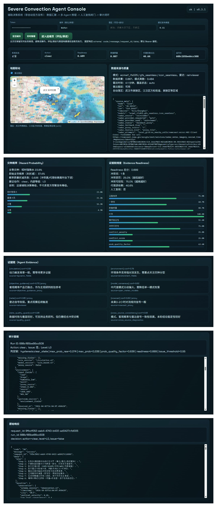

# 强对流预警多智能体系统整体说明文档

## 1. 系统定位与边界
- 系统定位：强对流预警**辅助决策系统**（工程化原型）
- 核心目标：融合多源气象信息，形成灾种概率、建议动作、审计证据链，辅助预报员快速研判
- 明确边界：不是官方自动发布系统；输出仅为建议，关键动作必须人工复核

## 2. 技术栈与工程结构
- 后端：Python + FastAPI
- 前端：原生 HTML/CSS/JS + Leaflet
- 存储：
  - SQLite：实验与运行注册表（`runs/registry.db`）
  - JSON：回放、审计、真值产物、长期记忆
- 鉴权：Bearer Token
- 响应协议：固定 schema（`code/message/request_id/data`）

主要目录：
- `weather_agent/`：后端核心实现
- `web/`：前端页面（主页 + 运维页）
- `config/`：运行配置（dev/test/prod_like）
- `scripts/`：初始化、评估、演进、回归、迁移等脚本
- `runs/`：运行产物与报告
- `memory/`：长期记忆参数
- `tests/`：单元/集成测试

## 3. 领域模型
核心模型（`weather_agent/models.py`）：
- `Observation`：统一输入快照（环境、雷达、客观概率、source_meta）
- `EvidenceCard`：单 Agent 证据卡（claim/confidence/hazard_scores/provenance）
- `FusionResult`：融合结果（`hazard_prob_raw`、`hazard_prob`、readiness、冲突、贡献分解）
- `WarningDecision`：决策结果（action/level/issue、闸门痕迹、人工复核标记）
- `AuditRecord`：审计记录（provenance、fusion_snapshot、decision_trace）

## 4. 多智能体与职责
当前默认 Agent（8个）：
- `circulation`：动力触发条件
- `environment`：热力/湿度/风切环境支持度
- `objective_guidance`：客观概率产品（当前部分仍为代理）
- `model_consensus`：多模式一致性
- `radar`：雷达回波特征（实源优先，代理回退）
- `nowcast`：0-2小时短临维持/增强信号
- `data_quality_guard`：数据质量诊断（v3 起为诊断型，不直接给灾种概率投票）
- `cross_source_consistency`：跨源一致性诊断

## 5. 数据源与可信度分层
### 5.1 运行时数据
- 模式：Open-Meteo（ECMWF/GFS/ICON）
- 雷达：`local_grid -> nowcoast -> rainviewer` 优先链
- 客观概率：由特征工程生成（当前存在代理成分）

### 5.2 代理源治理
- 所有代理输入显式标记 `proxy_source=true`
- 融合层对代理输入应用权重上限 `proxy_weight_cap`
- 前端显示代理依赖占比 `proxy_dependency_ratio`

## 6. Orchestrator 主流程
`ForecastOrchestrator.run_cycle` 统一执行：
1. 调度各 Agent 生成 `EvidenceCard`
2. 标准化补齐 provenance（输入字段、上游源、时间、缺失项、规则版本）
3. 调用融合层得到：
   - `hazard_prob_raw`（融合原始概率）
   - `probability_quality_factor`（概率质量折减系数）
   - `hazard_prob`（折减后概率）
   - readiness 与冲突诊断
4. 执行决策闸门：
   - issue/clear 双阈值 + 滞回
   - 最小持续时长
   - 覆盖约束
   - 高冲突/降级/高代理依赖时强制 `manual_review`
5. 产出 `WarningDecision` + `AuditRecord`

## 7. 融合算法（关键）
融合层（`weather_agent/fusion.py`）包含以下机制：
- Agent 基础权重（可学习）
- 同源相关性惩罚（降低信息重复计票）
- 代理源权重上限
- `diagnostic_only` Agent 不参与灾种概率计票
- 冲突检测：按灾种分歧 spread 生成 conflicts

新增关键结果：
- `hazard_prob_raw`：融合原始概率
- `probability_quality_factor`：根据冲突、数据质量、时效、代理依赖等计算
- `hazard_prob = hazard_prob_raw * probability_quality_factor`

设计目的：避免“高冲突场景下概率仍偏高”的误导性输出。

## 8. 决策层机制
决策输出字段：
- `action`：`clear` / `monitor` / `suggest_issue` / `manual_review`
- `level`：内部等级 `L0~L3`（非官方发布等级）
- `issue`：是否满足建议发布门槛
- `requires_human_review`：是否触发人工复核

关键闸门条件（任一触发可转人工复核）：
- 空间覆盖不足
- 雷达过期
- 冲突过高
- 关键源降级
- 代理依赖过高

## 9. 评估与演进治理
### 9.1 真值标签
- 来源：NOAA ISD站点 + 本地冰雹报告融合
- 标签分层：`gold/silver/proxy`
- 正式评估/正式演进仅允许 `gold/silver`

### 9.2 评估（evaluate）
- 强制时间切分：train/calibration/test（防数据泄漏）
- baseline 与 enhanced 使用同一 test 集
- 正式模式可设置硬门槛：
  - 最低真值覆盖
  - 最低正例样本数（不足直接失败）
- 输出：JSON/Markdown/HTML 报告 + 统计效力说明

### 9.3 演进（evolve）
权重优化（`weather_agent/evolver.py`）：
- 在 train 集计算每个 Agent 误差（Brier 形式）
- `quality = 1 - brier`
- 原始权重：`raw = 0.6 + 1.2 * quality`
- 归一化到均值 1
- 样本收缩（防小样本过拟合）：
  - `shrink = min(1.0, train_samples / 200.0)`
  - `final_weight = 1 + shrink * (normalized - 1)`
- calibration 集训练概率校准器（histogram/beta），样本不足则回退

## 10. 审计、回放与实验注册
### 10.1 审计
- 每次推理都有 `run_id`
- 落盘：
  - `runs/cycle_<run_id>.json`
  - `runs/audit/audit_<run_id>.json`
- 含字段级 provenance、per-agent contribution、decision_trace

### 10.2 注册表
- SQLite 记录 `predict/eval/evolve` 运行元数据
- 记录 config hash、code hash、数据窗口、结果摘要

### 10.3 回放
- 支持按 run_id 查询审计、回放案例、对比 baseline/enhanced

## 11. API 概览
核心接口：
- `POST /api/v1/forecast/live`
- `POST /api/v1/forecast/manual`
- `POST /api/v1/truth/build`
- `POST /api/v1/evaluate/recent`
- `POST /api/v1/evolve/weights`
- `POST /api/v1/windows/scan`

窗口扫描兼容路径（为前端与历史客户端兜底）：
- `POST /api/v1/window/scan`
- `POST /api/v1/windows_scan`
- `POST /api/v1/scan/windows`

审计回放：
- `GET /api/v1/audit/{run_id}`
- `POST /api/v1/replay/case`
- `POST /api/v1/replay/compare`

## 12. 前端页面分工
- 主页：`/`
  - 仅保留实时推理（定位、实时推理、地图联动、证据展示）
  - 避免误触治理操作
- 运维页：`/web/ops.html`
  - 真值构建、窗口扫描、评估、演进
  - 面向离线治理任务

## 13. 当前能力结论（技术角度）
- 已具备：多源融合、代理降权、冲突闸门、审计可追溯、评估演进闭环、前后端联动
- 仍需持续增强：更高可信雷达体扫/格点、官方客观概率产品、空间评估从点位代理向完整网格业务化升级

## UI Screenshot

